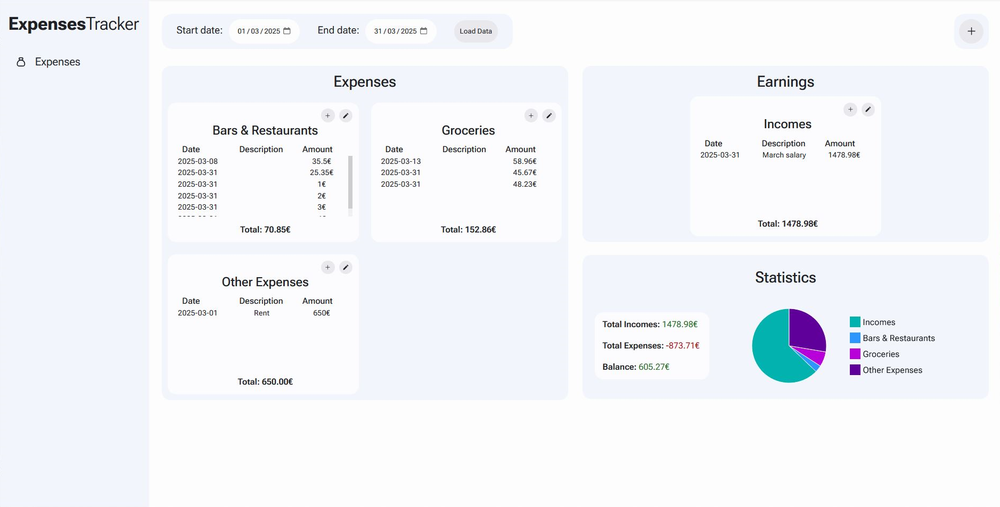
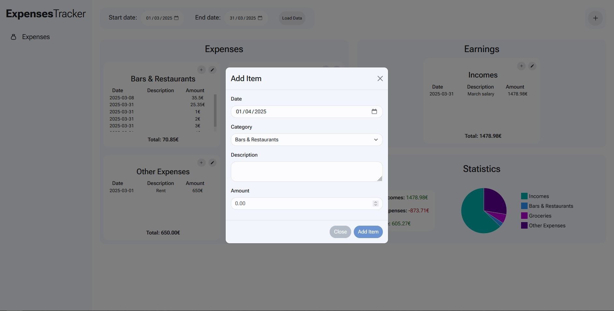
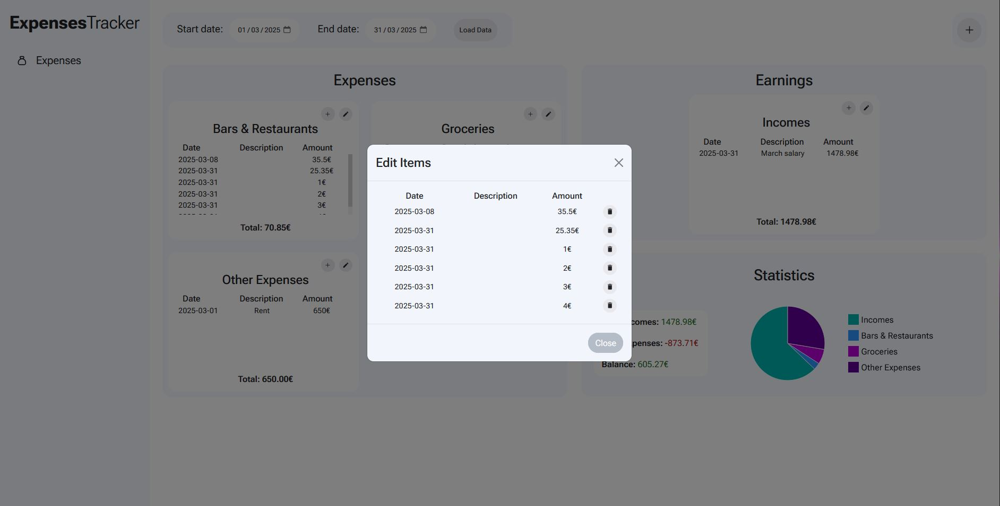

# ExpensesTracker
Full-stack application written in Python/Flask + MongoDB for the _backend_ and React for the _frontend_.

ExpensesTracker is an application for managing the expenses and the earning and to keep track of the final balance.

# Run locally

## Backend

### Prerequisites
<a href="https://www.mongodb.com/docs/manual/installation/">MongoDB</a> installed in your machine.

### Install required Python libraries
Use the requirement.txt file to install the required Python libraries:

```
pip install -r ./ExpensesTracker/backend/requirements.txt
```

## Frontend

### Prerequisites
<a href="https://react.dev/learn/creating-a-react-app">React</a> installed in your machine.

## Install required node_modules

In `ExpensesTracker/frontend/expenses-tracker` folder:

```
npm install
```

# Screenshots



